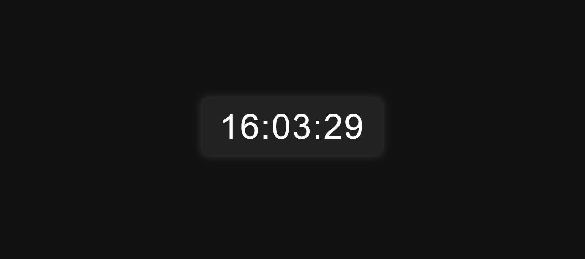

# Digital Clock ⏰

A simple digital clock built using **HTML, CSS, and JavaScript**.  
Displays the current time in **HH:MM:SS** format and updates every second.

---

## ✨ Features
- Live clock updating every 1 second
- Automatically adds leading zeros (e.g., 09:03:07)
- Clean dark UI with a glowing effect
- Minimal and easy to integrate into any webpage

---

## How to Run
1. Download all three files (index.html, style.css and script.js).
2. Place them in the same directory.
3. Open `index.html` in your browser.
4. The clock starts automatically — no setup required.

---

## 📸 Preview

  

---